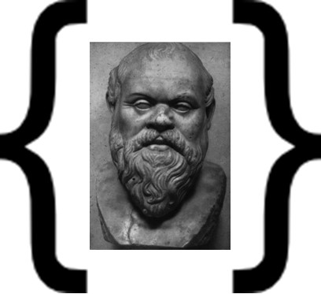

This is where the about text will go. Copy + Paste. 

Below is html for figure insertion.

To add URL, follow this synatx: [Wikipedia](https://en.wikipedia.org/wiki/Christopher_Hitchens):

To make something indented, put > in front of the paragraph as below

<figure>
  
  <figcaption>
      Pic caption goes here.
  </figcaption>
</figure>

From 

>Hey, Im indented!

``and I am code``

1. I enjoy markdown
2. It works automatically 

* how about this
* or this
